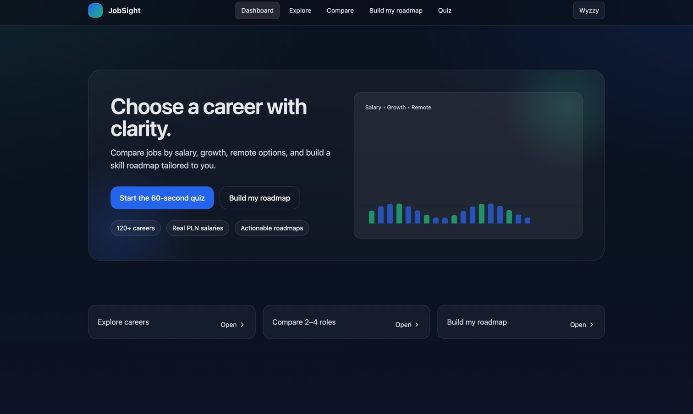
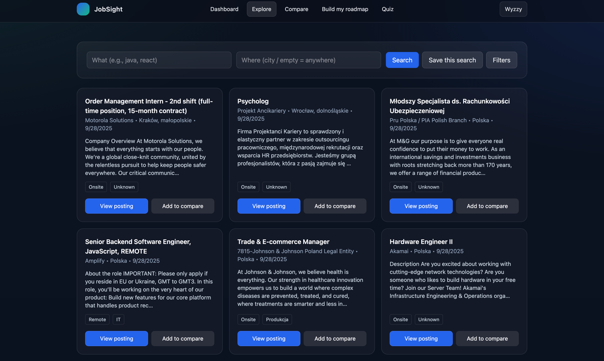
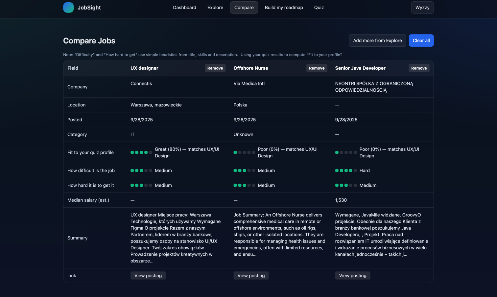
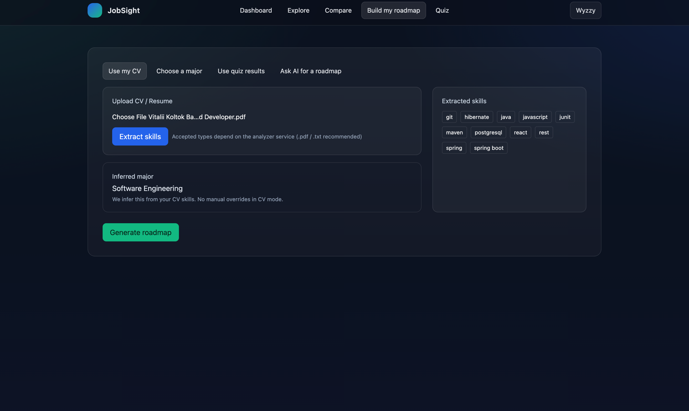
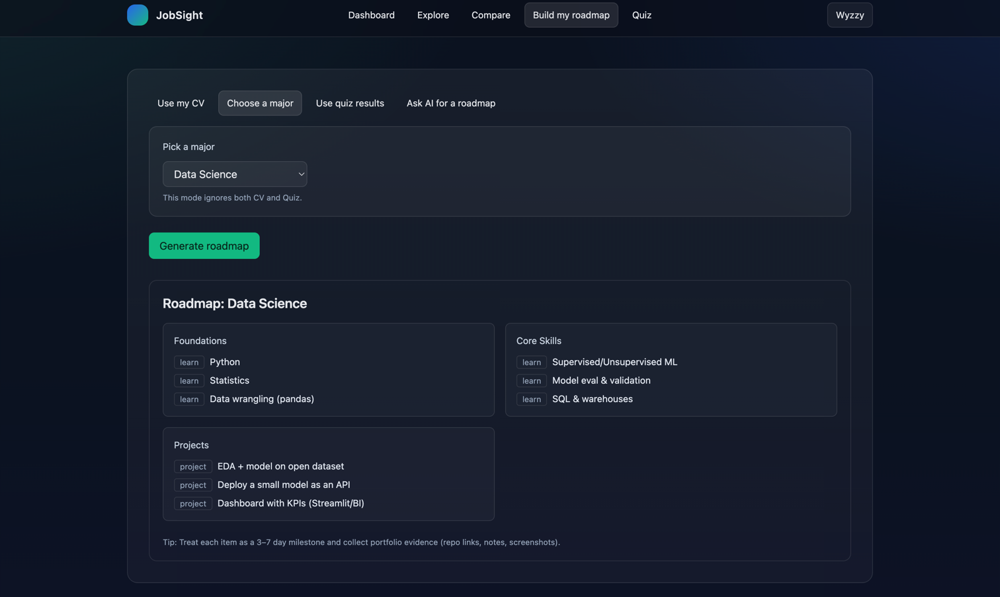
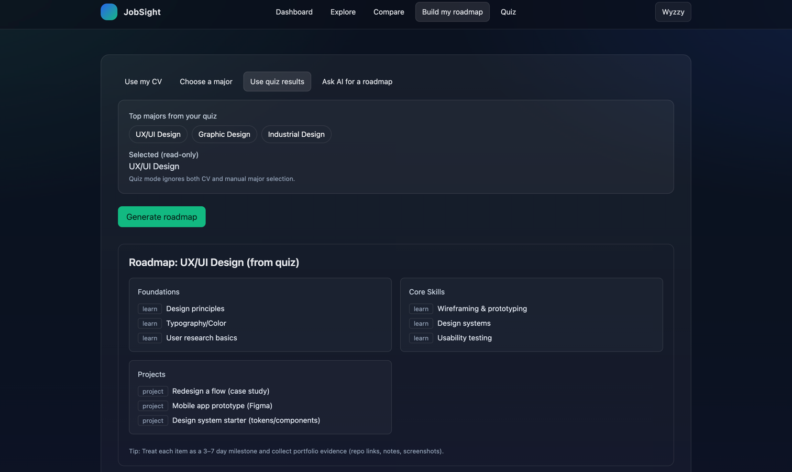
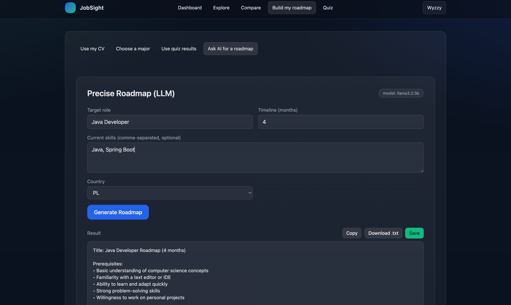
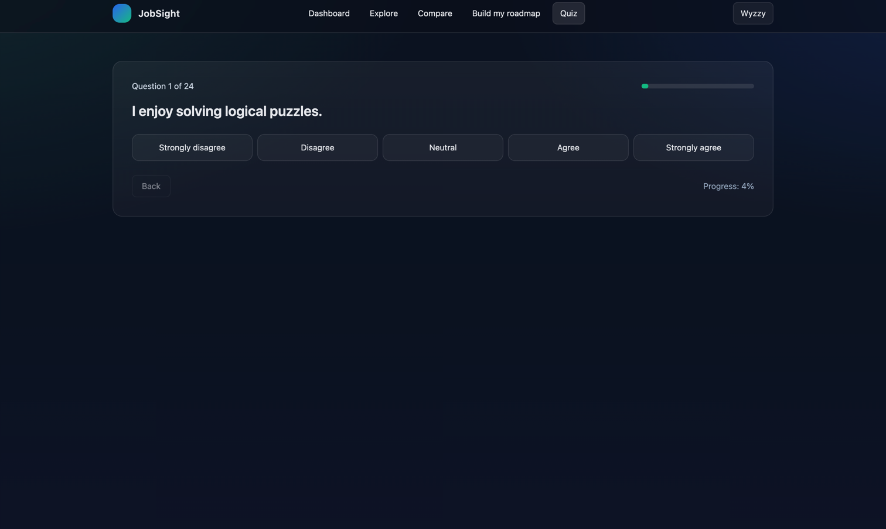
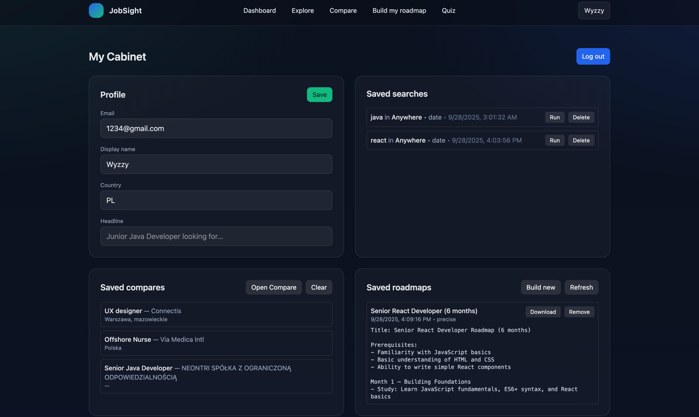

# JobSight — AI-powered job search & career roadmaps

**JobSight** helps candidates (and recruiters) move faster: search real jobs, compare roles side-by-side, generate **AI study roadmaps** from your goals or résumé, and save everything to your profile. It’s a full-stack, production-style app built with modern tooling and security best practices.

---

## ✨ Features

* **Explore jobs** with filters (what/where, date, salary heuristics), pagination, and quick actions.
* **Compare up to 3 roles** side-by-side (difficulty, how hard to get, salary median, summary).
* **AI Roadmaps**

  * “Precise” mode from your role, skills, timeline, and country.
  * From resume: extracts skills using a python microservice and builds a tailored plan.
  * Save, download, or copy the results.
* **Profile**

  * View saved searches, saved compares, saved roadmaps, quiz results.
  * Update display name, country, headline.
* **Authentication**

  * Register / Login / Logout, `HttpOnly` cookie (secure by default), protected endpoints.
* **Persistence**

  * PostgreSQL storage for users, saved searches, compares, quiz results, and roadmaps.

---

## 🏗️ Architecture

* **Frontend:** React (Vite) + TailwindCSS, cookie-based auth, proxy to backend (`/api`).
* **Backend:** Spring Boot 3 (Java 21), Spring Security (JWT), JPA/Hibernate.
* **DB:** PostgreSQL.
* **AI:** Ollama (local LLM, default `llama3.2:3b`).
* **Resume Analyzer (service):** accepts a file, extracts skills, feeds the roadmap builder.
* **Containerization:** Docker Compose for one-command local run.

```
frontend (Vite)  ─┐
                  ├──> backend (Spring Boot) ──> Postgres
Ollama (LLM)     ─┤
Resume Analyzer  ─┘
```

---

## 🚀 Quick Start (Docker)

**Prereqs:** Docker Desktop (or compatible).
From the repo root:

```bash
docker compose up -d
```

* Frontend: [http://localhost:5173](http://localhost:5173)
* Backend API: [http://localhost:8080](http://localhost:8080)

> If the LLM model isn’t pulled yet, Ollama will download it on first use (can take a bit). You’ll see CPU spike; when it’s ready, the roadmap endpoints respond with results.

---

## ⚙️ Configuration

Environment variables (via `.env` or compose):

```
# JWT signing secret (HMAC)
AUTH_JWT_SECRET=SecretSecret

# Database
SPRING_DATASOURCE_URL=jdbc:postgresql://postgres:5432/url
SPRING_DATASOURCE_USERNAME=username
SPRING_DATASOURCE_PASSWORD=password

# LLM model 
OLLAMA_MODEL=llama3.2:3b
```

Spring reads `auth.jwt.secret` (mapped from `AUTH_JWT_SECRET`).
Frontend’s Vite dev server proxies `/api` → `http://localhost:8080` and sends cookies (`credentials: "include"`).

---

## 🔐 Security Highlights

* `HttpOnly` auth cookie (`jid`) prevents JavaScript access.
* SameSite=Lax, CSRF disabled for API JSON; CORS restricted to dev origins.
* Passwords hashed with BCrypt.
* JWT verified server-side per request; protected routes require authentication.

---

## 🖼️ Screenshots


```md
### Dashboard


### Explore


### Compare


### Roadmap from CV


### All the Roadmaps


### Roadmap using Quiz results


### AI Roadmap 


### Quiz


### Profile


```

---

## 🧭 Key Endpoints

**Auth**

* `POST /api/auth/register` — `{email, password}` → sets cookie, returns user.
* `POST /api/auth/login` — `{email, password}` → sets cookie, returns user.
* `POST /api/auth/logout` — clears cookie.
* `GET /api/auth/me` — current user (requires cookie).

**Jobs**

* `GET /api/jobs/search?what=&where=&fullTime=&permanent=&sortBy=&page=&size=`

  * Public; returns paged listings (normalized by the UI).

**Saved (auth required)**

* `POST /api/saved/searches` / `GET /api/saved/searches` / `DELETE /api/saved/searches/{id}`
* `POST /api/saved/compares`  / `GET /api/saved/compares`  / `DELETE /api/saved/compares/{id}`
* `POST /api/saved/quiz`      / `GET /api/saved/quiz`
* `POST /api/saved/roadmaps`  / `GET /api/saved/roadmaps`

**Roadmaps / AI**

* `POST /api/roadmap/precise` — body: `{ targetRole, currentSkills, timelineMonths, country }`
* `POST /api/roadmap/from-resume` — multipart `{ file }`
* `POST /api/roadmap/from-skills` — body: `{ skills: [], roleId }`

---

## 🧑‍💻 Local Development

**Frontend**

```bash
cd frontend
npm i
npm run dev   # http://localhost:5173
```

**Backend**

```bash
cd backend
./mvnw spring-boot:run
```

The Vite dev server proxies `/api` to the backend on port **8080** and includes cookies by default. Make sure `AUTH_JWT_SECRET` and DB creds are set (or start with docker compose).
